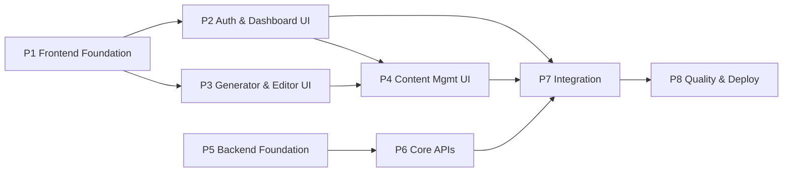

# Task Plan — AI Medium Blog Generator

Derived from [spec.md](spec.md). UI phases come first (per priority), backend follows, then integration wires them together. Each task is independently completable and reviewable.

**Legend:** 🎨 UI · ⚙️ Backend · 🔌 Integration · 🚀 Ops — Status: ☐ todo / ◐ in progress / ☑ done

---

## Phase 1 — 🎨 Frontend Foundation
> Goal: running Next.js app with design system, theming, and app shell.

- ☑ **T1.1 — Project scaffold**: Next.js 15 (App Router) + TypeScript + Tailwind + shadcn/ui init; folder structure (`app/`, `components/`, `lib/`, `hooks/`, `types/`); ESLint + Prettier.
- ☑ **T1.2 — Design system & theming**: Tailwind theme tokens (gradients, glassmorphism utilities, radii), dark/light mode with toggle + persistence, base typography, Framer Motion setup.
- ☑ **T1.3 — App shell & sidebar**: responsive layout with collapsible sidebar (all 11 menu items), topbar (search, theme toggle, avatar menu), mobile drawer, active-route highlighting.
- ☑ **T1.4 — Shared UI kit**: stat card, data table (sort/paginate), modal, toast (sonner), loading skeletons, empty states, pagination, search input, filter chips, confirm dialog.

## Phase 2 — 🎨 Auth & Dashboard UI (mock data)
> Goal: every auth screen and the dashboard, running on mock fixtures / MSW.

- ☑ **T2.1 — Auth pages**: Sign Up, Login, Forgot/Reset Password — React Hook Form + Zod, OAuth buttons (Google/GitHub), error/loading states, redirect logic scaffolding.
- ☑ **T2.2 — Dashboard page**: welcome header, 4 stat cards, recent activity feed, quick actions; skeleton loaders; mock data layer behind TanStack Query hooks (swap-ready for real API).
- ☑ **T2.3 — Profile & Settings pages**: profile edit form, settings (theme, defaults, autosave interval, notifications).
- ☑ **T2.4 — Billing page (surface)**: plans grid, current plan card, token usage meter, upgrade CTA (stubbed).

## Phase 3 — 🎨 Blog Generator & Editor UI
> Goal: the core product surfaces, still on mocks.

- ☑ **T3.1 — Generator form**: all fields from spec §3.4 (topic, keywords tag-input, style/tone/audience/language selects, word-count + creativity sliders, category, 7 toggles), Zod schema, template pre-fill support.
- ☑ **T3.2 — TipTap editor**: full toolbar (spec §3.5), code blocks w/ syntax highlighting, tables, images, emoji, Markdown import/export, autosave hook.
- ☑ **T3.3 — Generation experience**: streaming-into-editor UI (SSE client), progress states, regenerate-section actions, token usage badge (mock stream first).
- ☑ **T3.4 — Featured image UI**: generate-from-prompt panel, upload + crop + resize + download, attach to blog.
- ☑ **T3.5 — SEO panel**: score gauge, pass/fail checklist, editable SEO title / meta description / slug, keyword density, reading time, link suggestions.

## Phase 4 — 🎨 Content Management & Analytics UI
- ☐ **T4.1 — Drafts page**: list with search/filter/pagination, card + table views, duplicate/archive/restore/delete actions with confirms and optimistic updates.
- ☐ **T4.2 — Published blogs page**: list with status, published date, Medium link, update/unpublish actions.
- ☐ **T4.3 — Blog history view**: per-blog timeline (created/updated/published, tokens used, versions with restore).
- ☐ **T4.4 — Templates gallery**: 15 built-in template cards, preview modal, "Use template" → prefilled generator.
- ☐ **T4.5 — Analytics page**: Recharts — blogs over time, AI usage, monthly publishing, SEO score distribution; date-range filter.
- ☐ **T4.6 — Medium integration page**: connect form (token input), connection status card, test connection, publish options UI (now/schedule/draft, public/unlisted), export fallback UI.

## Phase 5 — ⚙️ Backend Foundation
- ☐ **T5.1 — Backend scaffold**: Express + TypeScript, layered structure (routes/controllers/services/repos), error envelope, request logging, health check; Docker Compose with Postgres.
- ☐ **T5.2 — Prisma schema & migrations**: all 11 models from spec §4 with relations/indexes; initial migration; seed script (templates, categories, demo user).
- ☐ **T5.3 — Auth API**: register/login/logout/refresh (JWT rotation, bcrypt), forgot/reset password, Google + GitHub OAuth, auth middleware.
- ☐ **T5.4 — Security hardening**: Helmet, CORS allowlist, rate limiting (global + AI routes), Zod validation middleware (schemas shared with frontend via package or duplication strategy), HTML sanitization, CSP.

## Phase 6 — ⚙️ Core Backend APIs
- ☐ **T6.1 — Blogs CRUD API**: list (cursor pagination, filters), get, create, update, soft delete, duplicate, restore, archive; draft version snapshots.
- ☐ **T6.2 — AI service**: OpenAI integration — `/ai/generate` (SSE streaming, prompt builder from generator config per spec §3.4), `/ai/improve`, `/ai/rewrite`, `/ai/seo`, `/ai/image`; AIUsage token accounting.
- ☐ **T6.3 — SEO engine**: score computation (rule checklist), slug/reading-time/keyword-density calculators, linking suggestions.
- ☐ **T6.4 — Medium publisher**: `PublisherAdapter` interface; Medium token adapter (connect, encrypted storage, test connection, publish/update/delete/fetch); export-fallback adapter; scheduled publish worker (cron) for ScheduledPost.
- ☐ **T6.5 — Analytics & dashboard API**: `/dashboard` aggregates, `/analytics` time series, `/usage` token totals.

## Phase 7 — 🔌 Integration
- ☐ **T7.1 — Wire auth**: replace mock auth with real API, token refresh interceptor, Next.js middleware route protection.
- ☐ **T7.2 — Wire blogs/drafts/templates**: swap mock hooks for real endpoints, optimistic updates, autosave → API.
- ☐ **T7.3 — Wire AI generation**: real SSE stream into editor, image generation, SEO panel live data, token badges.
- ☐ **T7.4 — Wire Medium + analytics**: connect flow, publish/schedule end-to-end, dashboard + analytics on real aggregates.

## Phase 8 — 🚀 Quality & Deployment
- ☐ **T8.1 — Unit tests**: backend services (auth, SEO engine, publisher adapter, AI prompt builder) + frontend component tests.
- ☐ **T8.2 — E2E tests (Playwright)**: signup → generate → edit → save draft → publish-fallback happy path; auth guard checks.
- ☐ **T8.3 — Docs**: README, API documentation, deployment guide, `.env.example` files.
- ☐ **T8.4 — Deployment**: Vercel (frontend), Railway/Render (backend), Neon (DB), env config, CI (lint + test + build).

---

## Dependency graph

Phases 1–4 (UI) and 5–6 (backend) are parallelizable tracks; UI track starts first per project priority.

## Suggested execution order
1 → 2 → 3 → 4 → 5 → 6 → 7 → 8 (strict UI-first), starting each backend phase once the UI track is stable.
